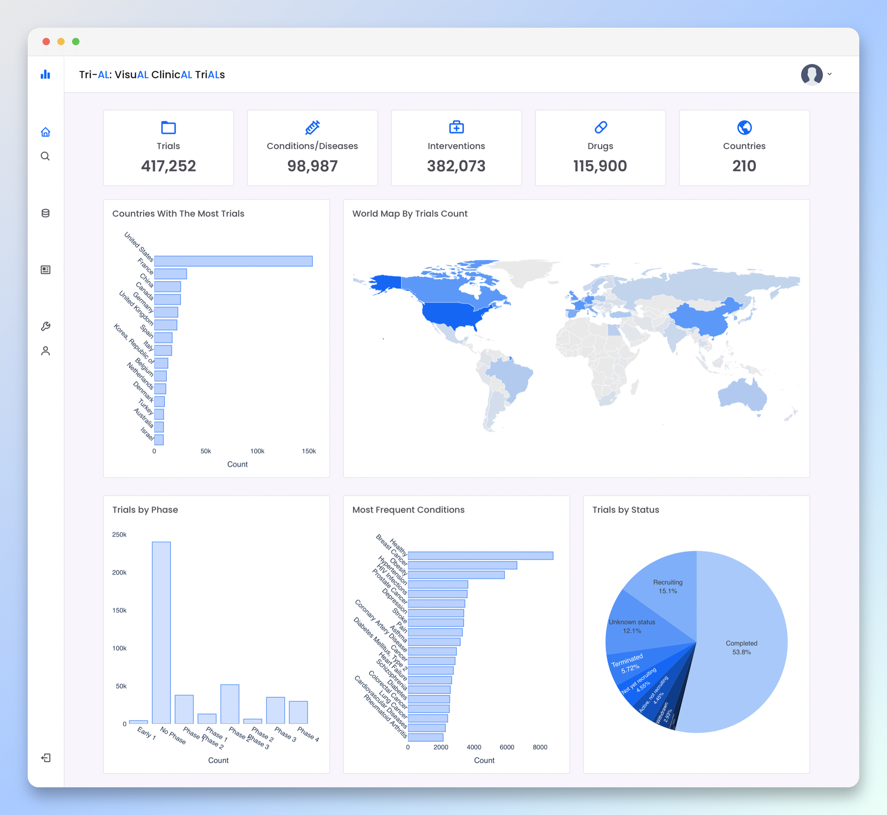

# Tri-AL: VisuAL ClinicAL TriALs

An visualization platform to keep track of [clinicaltrials.gov](https://clinicaltrials.gov) data along with more valuable tools. Tri-AL allows clinicaltrials researchers explore the database in a novel way.

Project Structure
------

    .
    ├── panels                  # Internal app for tri-al project that contains core of the server
    │   ├── api                 # Files that are responsible for REST-API to communicate with front-end
    │   └── utils               # Scripts to download and parse clinicaltrials.gov data and insert them into database
    ├── visual                  # Configuration files for Django app
    ├── schedulers              # bash scripts for scheduling tasks such as, updating database
    ├── initdb.sh               # Script to reset the database and make a new one with default values
    ├── httpd.conf              # Backup file of apache configuration for app
    ├── data_manager.py         # Main script to maintain database and download and fill database
    ├── manage.py               # Django script to perform different actions for app
    └── .gitignore
